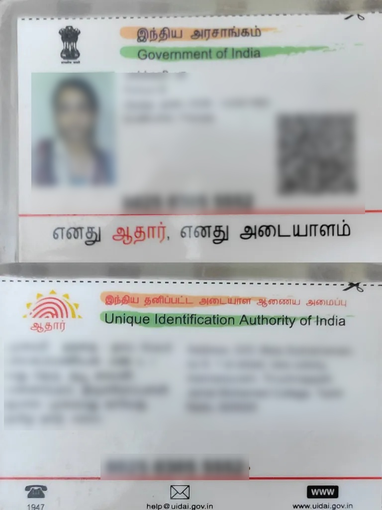

# Aadhaar OCR Project

Automates text extraction from Aadhaar documents using Python, EasyOCR, FastAPI, and OpenCV.
Supports English for KYC/document onboarding use cases.

## Features

- Extract text fields from Aadhaar card images
- Batch anonymization for demo/data privacy (OpenCV)
- REST API for uploading and OCR processing (FastAPI)
- Easy to customize for other ID/document types

## Demo

**Note:** All sample images are anonymized/blurred for privacy and compliance. Never upload real Aadhaar or sensitive data to public repositories.

## Installation

